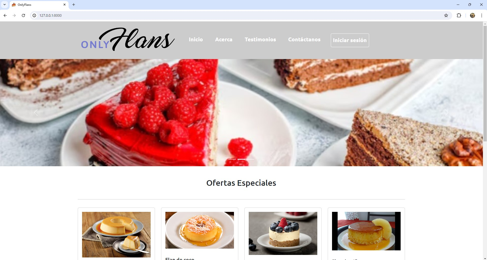

# Proyecto: Creación de Sitio Web para una PYME de Venta de Pasteles y Postres

## Descripción del Proyecto

OnlyFlans es una empresa enfocada en el mundo de la pastelería y los postres. Este proyecto tiene como objetivo desarrollar un sitio web para la empresa que permita mostrar sus productos y gestionar interacciones con los clientes.

### Hitos Incrementales del Proyecto

1. **Levantando el proyecto Django:** Preparación del ambiente e inicialización del proyecto Django desde cero, incluyendo la implementación de ramas git (main, develop y staging) y el presente README.md
  
2. **Creación del sitio web responsive con Bootstrap:** Creación de las primeras estructuras que permitirán mostrar datos en el sitio web.

3. **Añadiendo interacción a nuestro sitio web (modelos y formularios):** Creación de nuevos modelos de datos y habilitación de su interacción a través del panel de administración de Django y de un formulario personalizado.

4. **Manejando perfiles con Django:** Implementación de inicio y cierre de sesión, así como protección de una vista para hacerla inaccesible por usuarios no autenticados en el sistema.

5. **Presentación del proyecto:** Presentación del código funcional y explicación de las distintas particularidades desarrolladas en los hitos anteriores.

## Cronograma de Desarrollo

### Requerimientos

1. **Levantar primer proyecto en Django** *(días 1 a 3      //      9 de abril a 11 de abril)*
    - Utiliza el administrador de paquetes PIP para la instalación de los componentes Django.
    - Utiliza el utilitario manage.py para la creación de un nuevo proyecto Django.

2. **Crear sitio web responsive con Bootstrap** *(días 4 a 6        //      12 de abril a 15 de abril)*
    - Implementa un proyecto Django para servir contenido estático dando solución a los requerimientos.
    - Utiliza templates para la renderización de contenido dinámico en un proyecto Django para dar solución a un requerimiento.
    - Utiliza herencia de plantillas en un proyecto Django para dar solución a un requerimiento.
    - Utiliza instrucciones de control en plantillas de un proyecto Django para dar solución a un requerimiento.

3. **Añadir interacción al sitio web, a través de modelos y formularios** *(días 7 a 9      //      16 de abril a 18 de abril)*
    - Utiliza las clases provistas por el framework Django para la integración de un formulario básico.
    - Procesa un formulario Django utilizando templates para dar solución a un requerimiento.
    - Implementa plantillas de formulario reutilizables para dar solución a un requerimiento.
    - Maneja mensajes de errores de formularios en el template para dar solución a un requerimiento.

4. **Manejar perfiles con Django** *(días 10 a 12       //      19 de abril a 22 de abril)*
    - Describe las características del modelo de autenticación de Django para el control del acceso al aplicativo.
    - Describe las características del módulo de permisos y autorización disponible en Django para el control del acceso a un recurso.
    - Explica el concepto de Mixins en proyectos Django para control y seguridad de acceso.
    - Implementa el modelo Login/Logout de Django para el control del acceso al aplicativo.
    - Implementa el control de acceso a recursos de vista y de acciones a un aplicativo web utilizando el modelo de autorización y permisos de Django.
    - Reconoce las características básicas del sitio administrativo de Django y su utilidad en el modelo Auth.
    - Implementa el módulo administrativo de Django para la administración de usuarios.
    - Opera el módulo administrativo de Django realizando la administración de usuarios y grupos.

5. **Presentar proyecto** *(días 13 a 15        //      23 de abril a 25 de abril)*
    - Presenta el proyecto modular abordando cada uno de los hitos de creación de la aplicación web.

## Tecnologías Utilizadas

- **Backend:** Python 4.2.11 con Django
- **Base de Datos:** SQLite3
- **Frontend:** HTML5, CSS, Bootstrap, JavaScript

## Configuración del Entorno Virtual

Este proyecto utiliza un entorno virtual para gestionar las dependencias de Python. Asegúrate de tener Python 4.2.11 instalado. Puedes instalar las dependencias utilizando el archivo `requirements.txt`.

## Instrucciones de Instalación

1. Clona este repositorio en tu máquina local.
2. Activa tu entorno virtual.
3. Instala las dependencias utilizando el comando: - pip install -r requirements.txt

## Capturas de Pantalla

### Pantalla de Inicio

Sección de la página de inicio.

### Pantalla de Bienvenida

Sección de bienvenida para usuarios con sesión iniciada.

### Acerca de Nosotros

Sección con información acerca de la empresa.

### Testimonios

Sección con testimonios de clientes.

### Formulario de Contacto

Sección para formulario de contacto y mensaje de éxito al enviar el formulario.

### Inicio de Sesión

Sección para iniciar sesión dentro de la página.

### Bienvenida para Clientes

Sección para usuarios con sesión iniciada exclusivamente.

### Cerrar Sesión

Botón para cerrar la sesión.

### Panel de Administración

Panel de administración de la página.

### Panel de Postres

Listado de modelo de postres ingresado en el panel de administración.

### Panel de Usuarios

Listado de usuarios ingresados en el panel, pero que no son miembros del staff de administradores.

Comentario adicional: La clave tanto para los administradores como para los usuarios es 'desafio-latam2024' para facilitar el uso.

## Autor

Jose Contreras Stoltze
